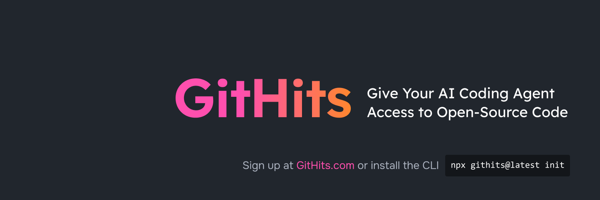

<p align="center">
  
</p>

<h1 align="center">GitHits CLI</h1>

<p align="center">
  The code context layer for AI coding agents.
</p>

<p align="center">
  <a href="https://www.npmjs.com/package/githits"></a>
  <a href="https://www.npmjs.com/package/githits"></a>
  <a href="https://github.com/githits-com/githits-cli/actions/workflows/main.yml"></a>
  <a href="https://github.com/githits-com/githits-cli/blob/main/LICENSE"></a>
  <a href="https://www.npmjs.com/package/githits"></a>
  <a href="https://modelcontextprotocol.io/"></a>
  <a href="https://skills.sh/githits-com/githits-cli"></a>
  <a href="https://smithery.ai/servers/githits/GitHits"></a>
  <a href="https://glama.ai/mcp/servers/githits-com/githits-cli"></a>
  <a href="https://lobehub.com/mcp/githits-com-githits-cli"></a>
</p>

<p align="center">
  <a href="https://githits.com">Website</a> ·
  <a href="https://docs.githits.com">Documentation</a> ·
  <a href="https://github.com/githits-com/githits-cli/issues">Issues</a>
</p>

GitHits connects AI coding agents to public open-source evidence across the
full software development lifecycle: discovery, planning, research,
implementation, debugging, and maintenance.

The CLI runs a local [MCP](https://modelcontextprotocol.io/) server that your
coding tool starts on demand. Agents can then search indexed package and
repository source, read exact files and documentation pages, inspect package
health, compare dependency upgrades, and find source-cited examples from real
open-source projects when model knowledge and local repository context are not
enough.

## Quick Start

```sh
npx githits@latest init
```

`init` signs you in, detects supported coding tools, and configures GitHits for
the tools you select. It uses the local stdio MCP except for Cursor, whose
direct setup uses the hosted remote MCP.

Automatic setup currently supports Claude Code, Cursor, Windsurf,
VS Code / Copilot, Cline, Claude Desktop, Codex CLI, Pi, Gemini CLI,
Google Antigravity, OpenCode, Hermes Agent, Zed, Junie, Qwen Code,
Kiro, Kilo Code, Factory Droid, and Amazon Q CLI.

After setup, open your coding agent and work normally. Many agents call GitHits
when they need source-backed context. If your agent starts guessing, prompt it
directly:

```text
Use GitHits Code Navigation to inspect npm:express. Find how middleware
errors are handled, read the relevant source, and explain the fix before
editing code.
```

## What GitHits Adds

GitHits is designed for the point where an agent needs evidence from the
broader open-source ecosystem, not just model memory or local repo context:

| Capability | MCP tools | CLI commands |
|---|---|---|
| Code examples | `get_example`, `search_language` | `githits example`, `githits languages` |
| Code navigation | `search`, `search_status`, `code_files`, `code_read`, `code_grep` | `githits search`, `githits search-status`, `githits code ...` |
| Documentation access | `docs_list`, `docs_read` | `githits docs ...` |
| Package inspection | `pkg_info`, `pkg_vulns`, `pkg_deps`, `pkg_changelog`, `pkg_upgrade_review` | `githits pkg ...` |
| Feedback | `feedback` | `githits feedback` |

Use GitHits when your agent needs to:

- discover, plan, or research how OSS projects solve a vague issue or unfamiliar error
- find broad prior art or rare needle-in-the-haystack examples across repositories
- inspect source, tests, symbols, or docs for a known package or repository
- verify how a dependency actually behaves before changing code
- debug stack traces that point into third-party code
- review package health, licenses, vulnerabilities, dependencies, and changelogs
- compare dependency upgrades using factual evidence

## Examples

Find prior art across open source:

```sh
npx githits@latest example "HTTP retries with exponential backoff in Python"
```

Search indexed code, docs, and symbols for a dependency:

```sh
npx githits@latest search "router middleware" --in npm:express
npx githits@latest search '"body parser" OR multer' --in npm:express --source docs
npx githits@latest search "debounce" --in npm:lodash --source symbol
```

Read and grep dependency source without cloning:

```sh
npx githits@latest code files npm:express lib
npx githits@latest code read npm:express lib/router/index.js --lines 120-200
npx githits@latest code grep npm:express "router.use" lib --regex
```

Inspect package health and upgrade evidence:

```sh
npx githits@latest pkg info npm:express
npx githits@latest pkg vulns npm:lodash@4.17.20 --severity high
npx githits@latest pkg deps npm:express@4.18.2 --depth 2
npx githits@latest pkg changelog npm:express --from 4.18.2 --to 5.2.1
npx githits@latest pkg upgrade-review npm:zod@4.3.6 --to 4.4.3
```

Browse and read package documentation:

```sh
npx githits@latest docs list npm:express
npx githits@latest docs read <page-id> --lines 20-80
```

## Supported Sources

GitHits works with package and repository targets such as:

- package specs: `npm:react`, `npm:react@18.2.0`, `pypi:requests`, `crates:serde`
- GitHub repos: `https://github.com/expressjs/express`, `github:expressjs/express#main`

Package inspection supports npm, PyPI, Hex, Crates, NuGet, Maven, Packagist,
RubyGems, Go, Swift, vcpkg, and Zig. Advisory data is unavailable for vcpkg and
Zig; dependency graph support varies by registry.

## License Filtering

Code example search supports license filtering:

- `strict` is the default and filters repositories with copyleft or undeclared licenses
- `custom` uses your account blocklist configured at [githits.com](https://githits.com)
- `yolo` disables license filtering

```sh
npx githits@latest example "async file reading" --lang python --license strict
```

## Authentication

Normal local setup is handled by:

```sh
npx githits@latest init
```

For manual login:

```sh
npx githits@latest login
```

Browser OAuth is recommended for local development. Credentials are stored in
the system keychain by default and refreshed automatically. Useful flags:

- `init --no-browser` or `login --no-browser` prints the login URL instead of launching a browser
- `init --port <port>` or `login --port <port>` fixes the loopback callback port
- `login --force` re-authenticates even if you are already logged in

The OAuth callback always listens on the machine where GitHits is running.
When GitHits runs over SSH and the browser runs locally, forward the selected
port from the browser machine:

```sh
ssh -N -L 8765:127.0.0.1:8765 user@remote-host
```

With that tunnel open, run GitHits on the remote machine using the same port:

```sh
npx githits@latest init --no-browser --port 8765
```

Open the URL printed by GitHits in the local browser. Replace
`user@remote-host` with the SSH destination you normally use. The same flags
work with `githits login` after setup.

Browser OAuth is interactive. For CI and other unattended environments, supply
`GITHITS_API_TOKEN` through the environment's secret manager.

### Keychain Prompts and File Storage

GitHits uses the system keychain by default because OAuth credentials include a
refresh token. On macOS this means Keychain Access; on Windows it means
Credential Manager; on Linux it means the available Secret Service or keyring
backend.

If macOS shows a prompt such as "githits wants to access ... in your keychain",
choose **Always Allow** when you trust the installed `githits` CLI. GitHits
cannot customize that operating-system prompt; it is generated by macOS.

GitHits also writes a small non-secret metadata file so recent startup checks do
not need to read the keychain. The keychain is only read when GitHits needs the
token, for example during a tool call, token refresh, `githits auth status`, or a
login check after metadata is stale or expired.

If your agent keeps showing keychain prompts even after **Always Allow**, switch
OAuth storage to file mode:

```toml
# macOS/Linux: ~/.config/githits/config.toml, or $XDG_CONFIG_HOME/githits/config.toml
# Windows: %APPDATA%\githits\config.toml
[auth]
storage = "file"
```

The config directory may be empty until you create `config.toml` or GitHits
writes auth metadata. Older macOS installs may have used
`~/Library/Application Support/githits`; GitHits still reads that location for
migration, but new auth config and file storage use `~/.config/githits`.

You can also opt in for one process:

```sh
GITHITS_AUTH_STORAGE=file githits login --force
```

File mode stores OAuth credentials as JSON files under the GitHits config
directory. The files are written with private permissions where the platform
supports it, but they are not encrypted. Any process that can read files as your
operating-system user may be able to read the tokens.

Use file mode only on machines where you trust local user-account access. For CI
and automation, prefer `GITHITS_API_TOKEN` instead of browser OAuth.

Inspect auth and runtime state with:

```sh
npx githits@latest auth status
npx githits@latest doctor
```

See the [authentication docs](https://docs.githits.com/authentication) for
keychain behavior, file storage mode, CI setup, and troubleshooting.

## Manual MCP Setup

If your coding tool is not auto-configured by `init`, add GitHits to its MCP
configuration manually:

```json
{
  "mcpServers": {
    "githits": {
      "command": "npx",
      "args": ["-y", "githits@latest", "mcp", "start"]
    }
  }
}
```

Your tool runs this command over stdio. No background daemon or global install
is required.

To remove configuration written by `init`:

```sh
npx githits@latest init uninstall
```

This removes GitHits MCP configuration and preserves stored credentials. Run
`npx githits@latest logout` separately to remove credentials.

## Project Setup

For project-local MCP config, run:

```sh
npx githits@latest init --project
```

Project setup is available only for tools with verified project-local MCP
support. Project config contains no secrets, but it may be committed like other
tooling configuration, so review generated files before adding them to source
control.

Agent-safe non-interactive setup uses staged discovery and explicit install:

```sh
npx githits@latest init --detect-agents --json
npx githits@latest init --install-agents cursor,codex
```

## Plugin and Extension Packaging

The repository and published package provide the plugin and extension assets
used by compatible hosts. Git-based installs also retain the context-file
symlinks (`CLAUDE.md` and `GEMINI.md`) to the canonical `AGENTS.md`:

- `.plugin/plugin.json`
- `.claude-plugin/plugin.json`
- `.claude-plugin/marketplace.json`
- `.codex-plugin/plugin.json`
- `.cursor-plugin/plugin.json`
- `.mcp.json`
- `gemini-extension.json`
- `plugin.json` (Google Antigravity)
- `mcp_config.json` (Google Antigravity)
- `AGENTS.md`
- `CLAUDE.md`
- `GEMINI.md`
- `skills/`

The root skill tree is shared by all supported hosts. Every plugin and extension
install uses the hosted remote MCP, including Claude, Codex, Cursor, Gemini CLI,
Google Antigravity, and VS Code/GitHub Copilot OpenPlugin. Direct `githits init`
setup is a separate path: it installs local stdio configurations for supported
tools except Cursor, which remains remote-only. The repository root is a native
Antigravity plugin through `plugin.json`, `mcp_config.json`, and the shared
`skills/` tree. Generated manifests are refreshed with `bun run plugins:generate`
and validated with `bun run plugins:check`.

For Claude Code marketplace installs:

```sh
claude plugin marketplace add githits-com/githits-cli
claude plugin install githits@githits-plugins
```

For Gemini CLI extension installs:

```sh
gemini extensions install https://github.com/githits-com/githits-cli
```

## Command Reference

```text
githits init             Connect GitHits to your coding agents
githits init uninstall   Remove GitHits MCP configuration
githits login            Sign in to your GitHits account
githits logout           Remove stored credentials
githits mcp              Show setup instructions or start the local MCP server
githits mcp start        Always start the local MCP server over stdio
githits example          Find real-world implementations from open source
githits languages        List or filter supported programming languages
githits feedback         Submit feedback about GitHits results
githits doctor           Diagnose configuration and auth state
githits search           Explore repository code, dependencies, docs, and symbols
githits search-status    Check the status of a previous indexed search
githits code             List, read, and grep indexed dependency source
githits pkg              Inspect package metadata, vulnerabilities, deps, and changelogs
githits docs             Browse and read package documentation
githits auth             Manage authentication
githits auth status      Show authentication status
```

Full CLI reference: https://docs.githits.com/cli/commands

## Environment Variables

Most users do not need environment variables. These are the common overrides for
CI, auth storage, and local diagnostics:

| Variable | Purpose | Default |
|---|---|---|
| `GITHITS_API_TOKEN` | API token for authentication | unset |
| `GITHITS_AUTH_STORAGE` | Override OAuth storage mode: `keychain` or `file` | `keychain` |
| `GITHITS_DISABLE_UPDATE_CHECK` | Disable npm latest-version update notices | unset |
| `GITHITS_TELEMETRY` | Emit local timing diagnostics to stderr | unset |

Full reference: https://docs.githits.com/cli/environment-variables

## Source Layout

This repository contains the GitHits CLI and reusable MCP package:

- `src/` - CLI commands, local auth, setup flows, and local MCP stdio startup
- `packages/mcp/` - public `@githits/mcp` package for transport-neutral MCP
  server APIs, tool registration, instructions, and smoke-test helpers
- `packages/core-internal/` - shared workspace implementation used by the CLI
  and MCP package
- `docs/` - implementation notes and contributor guidelines
- `scripts/` - package validation, smoke tests, and development utilities

See [CHANGELOG.md](CHANGELOG.md) for released changes, pending work, and the
current package-version impact.

## Development

Requirements:

- Node.js `^20.18.1 || >=22.13.0`
- Bun

Common commands:

```sh
bun install
bun run dev --help
bun test
bun run typecheck
bun run build
```

When changing MCP tools, CLI commands, shared formatters, auth/error envelopes,
or MCP/CLI parity behavior, also run the relevant smoke suites:

```sh
bun run smoke:mcp
bun run smoke:cli
```

CI also checks the built product without credentials or live backend calls. Run
the same checks locally after `bun run build`:

```sh
bun run smoke:cli:built
bun run smoke:mcp:built
```

The harness remains on Bun, while product subprocesses execute `dist/cli.js`
with `node` from `PATH`. CI provisions that runtime from `.node-version`.

When changing MCP instructions, tool descriptions, or agent-facing behavior,
use the targeted agent evals described in `eval/agentic/README.md`:

```sh
bun run agent:e2e
```

## License

Apache-2.0
