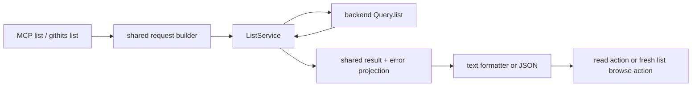

# Unified list client adoption

## Status and expected outcome

**Status: IN PROGRESS.** Phase 1A and the stacked Phase 1B CLI increment are
implemented and verified; both are awaiting merge.

Replace the advertised MCP `code_files` and `docs_list` tools with one `list`
tool, and add the matching top-level `githits list` command. The new surface
browses exactly one package source tree, repository snapshot, or hosted
documentation site, follows familiar path/glob semantics, paginates with an
opaque cursor, and emits backend-authored actions that feed directly into
`read` or another `list` call.

Package and repository inventories contain source files and documentation
files together. Hosted pages remain a separate inventory selected by an
explicit `site:` target. Content search remains the job of `search`; `list`
enumerates known inventory.

## Verified current state

### Backend contract

The committed backend schema hash is
`sha256:ac9f53af41edea8cdabe792de51c5f7f3a4a136b3fc71bf3adf96af8acfa6ac2`;
the newest `priv/graphql/CHANGELOG.md` entry records the matching
`sha256:ac9f53af41ed` prefix under **Unreleased**. It adds:

```graphql
list(
  target: String!
  paths: [String!]
  recursive: Boolean
  fileTypes: [String!]
  languages: [String!]
  intents: [FileIntent!]
  limit: Int
  after: String
  waitTimeoutMs: Int
): ListResult!
```

`ListResult` identifies a `SOURCE` or `SITE` inventory, returns bounded
`FILE`, `PAGE`, and `DIRECTORY` entries, exposes source or site lifecycle
metadata, and supplies `hasMore` plus `nextCursor` without claiming a total.
Each entry contains exact nullable `read` and `browse` actions. The action
target/path/paths are authoritative; `ListEntry.path` is display identity and
must not be reconstructed into a locator.

The permanent backend documentation establishes these semantics:

- A package target covers the manifest-owned source tree at the served commit,
  excluding sibling and independently owned nested packages. It does not claim
  exact registry-artifact contents. A repository target covers the whole served
  snapshot. A site target covers one registered, authorized site owner and never
  discovers or creates a site.
- Omitted paths browse immediate roots. Literal paths and globs form a union.
  `*`, `?`, character classes, backslash escaping, and whole-component `**` are
  supported. Dot-prefixed paths are ordinary inventory entries.
- Source paths are package- or repository-relative. Site paths are logical,
  host-qualified paths such as `expressjs.com/en/5x/api/`; emitted browse paths
  are the safest selectors and must be replayed unchanged.
- Glob depth is independent of recursion. With recursion off, selected
  directories expose immediate children. With recursion on, selected
  directories expand to descendant leaves and no directory rows are emitted.
- Source-only `fileTypes`, `languages`, and `intents` filters run before
  hierarchy and pagination. Nonempty source filters are invalid for sites.
- The default page size is 100 and the maximum is 500. At most 1,000 nonempty
  path operands of at most 2,048 UTF-8 bytes each are accepted. Wait is
  0-300000 milliseconds and defaults to zero.
- Continuation requires the same target, paths, recursion, and source filters.
  Limit and wait may change. A changed selection, source snapshot, site
  membership, or emitted site metadata returns `VALIDATION_ERROR`; callers
  restart from page one.
- Source file reads are pinned to a repository commit and exact
  repository-relative path. Package directory browsing stays package-scoped
  and version-pinned; it is unavailable when the backend cannot form a
  versioned package target. Hosted page reads use their exact persisted URL and
  reopen the latest active publication for that logical page.
- An unprepared source at zero wait returns its typed indexing error. Positive
  wait can return an `INDEXING` result with empty entries. Sites return active
  pages during refresh and report inventory, crawl, coverage, and preparation
  states separately.
- `SOURCE_INVENTORY_SCOPE_UNAVAILABLE` fails package scope closed and includes
  an explicit repository/commit alternative. `LIST_UNSUPPORTED_API` and
  `LIST_PAGE_TOO_LARGE` must not fall back to `listRepoFiles`.

Evidence:

- `~/proj/githits/pkgseer-backend/priv/graphql/schema.graphql`
- `~/proj/githits/pkgseer-backend/priv/graphql/CHANGELOG.md`
- `~/proj/githits/pkgseer-backend/graphql-docs/docs/list.md`
- `~/proj/githits/pkgseer-backend/docs/implementation/UNIFIED_LIST.md`

The changelog section is unreleased. The committed schema is the implementation
contract; availability on the hosted endpoint has not been verified and is a
rollout dependency, not a reason for a legacy client fallback.

### Current GitHits client surface

`code_files` calls `CodeNavigationService.listFiles` / `Query.listRepoFiles`.
It has sixteen MCP arguments, offset-like bounded results without a continuation
cursor, source-only output, and older path-prefix/selector/hidden semantics.
`docs_list` calls `PackageIntelligenceService.listPackageDocs`; it addresses a
package rather than an exact site and mixes hosted and repository-backed pages.
Its output does have cursor pagination.

The stable MCP catalog registers both tools in
`packages/mcp/src/mcp/server.ts`. `McpToolServices` currently injects
`CodeNavigationService`, `PackageIntelligenceService`, and the already unified
`ReadService`. CLI equivalents live at `githits code files` and
`githits docs list`; `githits read` demonstrates the intended migration pattern:
the compact top-level command uses a dedicated transport-neutral service while
legacy grouped commands remain on their legacy roots.

The current implementation and active documentation contain recovery hints,
quick-start routing, smoke assertions, catalog contracts, parity tests, and
agent workloads that name `code_files` or `docs_list`. Historical eval reports
remain historical evidence and are not rewritten.

The pre-change descriptor measurement at `175c15c` is 3,659 UTF-8 bytes for
`code_files`, 1,526 for `docs_list`, and 5,188 for their serialized pair
(`name`, description, input schema). This is a payload baseline, not a runtime
or token-latency claim.

## Scope and non-goals

Phases 1-2 include the transport service, shared
request/result/error/formatter layers, MCP tool, top-level CLI command, service
composition, migration of active guidance and recovery actions, tests, public
documentation, eval workloads, and release fragments.

It does not change backend inventory behavior, merge source and site storage,
discover documentation sites, add content search, redesign `code_grep`, remove
legacy CLI commands, deploy `pkgseer-backend` or `remote-mcp`, or publish a
release. It does not add a hidden-entry flag, prefix mode, client-side full
inventory scan, fallback to legacy GraphQL roots, fabricated total, or client
snapshot/cache infrastructure.

## Target contract

### Canonical surfaces

The MCP tool is named `list`. Its first description sentence is:

> List files or documentation pages in a package, repository, or site.

This sentence is under 80 characters and distinguishes enumeration from
content search. The MCP arguments map directly to `Query.list`:

| MCP argument | Backend argument | Contract |
| --- | --- | --- |
| `target` | `target` | Required compact package/repository target or explicit `site:` target |
| `paths` | `paths` | Optional literal/glob union; omitted or empty browses roots |
| `recursive` | `recursive` | Optional boolean; preserve explicit `false` |
| `file_types` | `fileTypes` | Optional source-only raw labels |
| `languages` | `languages` | Optional source-only raw labels |
| `intents` | `intents` | Optional source-only `FileIntent` values |
| `limit` | `limit` | Optional integer, 1-500 |
| `after` | `after` | Optional opaque cursor |
| `wait_timeout_ms` | `waitTimeoutMs` | Optional integer, 0-300000 |
| `format` | client-only | `text` by default; `json` for structured consumers |

Validation accepts empty arrays as omitted filters, rejects blank array
members, preserves explicit false values, and treats an empty cursor as
omitted. It enforces documented array/count/integer bounds before transport but
does not parse or rewrite emitted action values. Source filter names and values
remain visible in the schema instead of being encoded into path globs.

The CLI is:

```text
githits list <target> [paths...]
  -R, --recursive
  --file-type <type>   (repeatable)
  --language <name>    (repeatable)
  --intent <intent>    (repeatable)
  --limit <n>
  --after <cursor>
  --wait <ms>
  -v, --verbose
  --json
```

Paths are variadic positional operands so calls read like `ls` while retaining
the backend's single `paths` union. Help tells shell users to quote globs.
`--verbose` adds source metadata to terminal rows and enables the detailed
GraphQL projection. MCP text uses the compact projection; JSON uses the
detailed projection and carries the complete selected metadata.
`--after` deliberately matches `Query.list` and the existing docs-list cursor
flag; `--wait <ms>` matches `githits read` and code navigation commands. This
command does not adopt the search commands' seconds unit or grep's `--cursor`
spelling.

Examples:

```text
githits list npm:express@5.2.1
githits list npm:express@5.2.1 lib/ -R
githits list github:expressjs/express@v5.2.1 '**/*.md'
githits list site:expressjs.com 'expressjs.com/en/5x/api/'
```

### Result and output behavior

One shared projection and formatter serve MCP and CLI. JSON preserves the
selected backend contract in camelCase: inventory identity, requested and
canonical targets, entries and exact actions, continuation, source resolution
and indexing fields, and site inventory/crawl/coverage/preparation fields.
Nullable fields stay nullable where absence is meaningful; no synthetic total
or reconstructed action is added.

Text output has one inventory/resolution header, one compact row per entry, and
only relevant lifecycle and continuation footers. It must:

- make `FILE`, `PAGE`, and `DIRECTORY` distinguishable;
- retain page titles and exact readable URLs;
- expose each available read/browse action without treating display paths as
  selectors;
- group repeated source read targets where doing so preserves exact per-entry
  action paths;
- emit a directly reusable continuation call with the original selection and
  new cursor; and
- state incomplete/active preparation honestly rather than converting it to an
  empty/not-found message.

Formatter-authored punctuation is ASCII, backend Unicode is preserved, color
never carries meaning, and width/color are inputs. Before finalizing the text
layout, compare repository-root, nested-package, recursive-glob, and site
subtree fixtures for serialized output size and successful follow-up actions.

### Errors and continuation

The client preserves backend error codes, retryability, and safe extension
metadata in the existing mapped-error envelope. List-specific recovery is:

- `SOURCE_INVENTORY_SCOPE_UNAVAILABLE`: show the backend repository/commit
  alternative from typed `extensions.repo_url` and `extensions.commit_sha`,
  while stating that accepting it broadens scope;
- `VALIDATION_ERROR` on a call with `after`: because the backend does not expose
  a cursor-specific reason, advise restarting once without `after` and, if the
  error recurs, correcting the request; without `after`, advise correcting the
  request;
- site `NOT_FOUND`: resolve/register an explicit site target;
- indexing: retry the same call with bounded wait or inspect the emitted
  progress reference; and
- `LIST_UNSUPPORTED_API` / `LIST_PAGE_TOO_LARGE`: report the producer
  incompatibility without legacy fallback.

Transport, HTTP, authentication, terms, client-update, and malformed-response
behavior follows existing core service conventions. Unknown codes remain
visible rather than being misclassified from message text.

The scope-unavailable alternative is the one sanctioned client-composed
locator: only when both extension values are nonempty strings, form
`<repo_url>@<commit_sha>`, which `Query.list` and `read` accept as a pinned
repository target. If either field is absent, preserve the backend error without
inventing an action. This does not generalize into reconstructing entry actions.

## Target architecture and ownership

`packages/core-internal` naturally owns a new `ListService` because `Query.list`
is transport-neutral and crosses source/site domains. It owns request/result
types, minimal GraphQL selection, runtime validation, transport, token refresh,
and a dedicated list error family. That family reuses shared auth, terms,
client-update, HTTP, and transport primitives while owning list-specific
GraphQL codes and extension fields; it does not classify the target into the
older code-navigation/package-intelligence error families. Putting it into
`CodeNavigationService` would be a
smaller edit but would make hosted-site inventory depend on a source-only
abstraction; that ownership is wrong.

`packages/mcp/src/shared` owns caller normalization, JSON projection, error
mapping, and the shared text formatter. `packages/mcp/src/tools/list.ts` owns
the MCP descriptor and handler. `src/commands/list.ts` owns Commander syntax
and terminal invocation. `src/container.ts` and `McpToolServices` inject the
service; hosts continue to own endpoint, token/header/fetch, diagnostics, and
request scope.



`ListService` is exported by `packages/core-internal/src/index.ts`. Phase 2
exports it through the public `@githits/mcp/client` entrypoint and makes
`McpToolServices.listService` a required host integration field, following
`readService`. Its request has an
internal compact/detailed projection choice: MCP text and non-verbose CLI text
select common identity, actions, continuation, and displayed lifecycle fields;
JSON and verbose CLI additionally select file metadata and full resolution,
availability, estimate, coverage-reason, and preparation detail through
GraphQL `@include` variables. Response schemas accept omitted detail fields.
Wire tests assert variables and selections for both projections, including that
neither fetches bodies, snippets, or section trees.

## Cross-cutting constraints

- **Compatibility:** remove `code_files` and `docs_list` from the advertised
  MCP catalog when `list` lands. Keep `githits code files` and
  `githits docs list` on their unchanged legacy services as compatibility
  cohorts, but add a concise deprecation pointer to `githits list` in their help
  text. Their execution behavior, scope, and pagination remain unchanged; they
  are not aliases for `githits list`.
- **Custom endpoints:** compact `list` requires `Query.list`. Do not silently
  call deprecated roots when the endpoint lacks it.
- **Migration/rollback:** the client package can be rolled back to restore the
  old advertised MCP catalog. Backend legacy roots remain intact. No data
  migration or feature flag is needed.
- **Security:** all surfaces remain read-only information tools. Treat external
  titles and paths as data, never commands. Preserve action strings exactly in
  structured output and quote them safely in terminal follow-ups. Never log
  cursors or user tokens through diagnostics beyond existing request metadata
  policy.
- **Performance:** the service requests only bounded metadata. Paging and
  filtering remain backend-owned; no client-side materialization is allowed.
  Descriptor bytes are measured before/after with the same serializer. Runtime
  optimization requires a demonstrated client regression; backend query
  performance is outside this repository.
- **Documentation:** create `docs/implementation/unified-list.md`; update active
  tool, CLI, parity, config, and annotation documentation. Update canonical
  skills/instructions through the plugin-maintenance workflow and regenerate
  generated assets. Historical observations stay unchanged.
- **Release impact:** each increment adds its own fragment. The CLI increment
  marks `githits: minor`, `@githits/mcp: none`; the MCP consolidation marks both
  artifacts `minor`, matching the unified-read precedent and the public surface
  changes. Release preparation can reassess only if the repository's 0.x policy
  changes before merge.

## Assumptions and unknowns

Overall assumptions:

- The committed backend SDL and permanent list documentation are the client
  contract.
- `Query.read` continues to accept emitted list actions unchanged.
- Hosted MCP continues to consume the published `@githits/mcp` package and
  compose services per request.

Overall unknowns:

- The date when `Query.list` reaches an authenticated test and hosted GraphQL
  endpoint is unknown. It must be resolved before Phase 2 agent/live validation
  and Phase 3 release/deployment, not before Phase 1 implementation.
- Final released package versions and remote deployment timing are unknown and
  are chosen during authorized release/adoption work.

Open product decisions: **none**. The user chose one paths/glob input, separate
target inventories, combined files/docs within source targets, and `ls`-like
query ergonomics. The backend contract resolves glob, hidden-path, recursion,
filter, paging, action, and lifecycle details.

## Phase map

| Phase | Status | Outcome |
| --- | --- | --- |
| 1. Add the shared contract and CLI | **IN PROGRESS** | Increments 1A and 1B are implemented and verified, and await merge; `githits list` browses the committed backend contract through a tested transport-neutral service and shared formatter. |
| 2. Consolidate the MCP surface | **PLANNED; test-endpoint dependent** | The advertised catalog contains `list` instead of `code_files` and `docs_list`, and agent guidance routes package/repository/site browsing and follow-up actions correctly. |
| 3. Release and hosted adoption | **PLANNED; authorization/deployment dependent** | Published CLI and hosted MCP expose the same unified list contract, and live list-to-read/list-to-list paths pass against the deployed backend. |

## Phase 1 detailed plan — shared contract and CLI

**Status:** IN PROGRESS; increments 1A and 1B are implemented and verified, and await merge.

**Expected outcome:** the root CLI implements the committed backend contract
through a transport-neutral `ListService`. `githits list` can browse all three
target kinds, continue pages, and render exact read/browse actions. Existing
grouped CLI commands keep their legacy execution paths and point users toward
the new command.

**Assumptions:** the verified SDL is stable for this increment; existing endpoint,
token refresh, headers, diagnostics, error envelopes, and formatter conventions
remain reusable.

**Unknowns or product decisions:** none. Hosted availability is not required to
implement or deterministically validate transport, projection, and CLI behavior.

**Dependencies:** backend commits containing schema hash
`sha256:ac9f53af41ed`; current unified `read` implementation.

**Delivery split:** implementation reached about 1,700 changed non-test lines
after the transport and shared-contract work, before CLI wiring. Per the
repository size rule and the split point below, Phase 1 is delivered as two
stacked review increments: **1A** owns the private core transport plus shared
request/result/error/formatter contract; **1B** owns the top-level CLI,
container/help/smoke integration, user-facing documentation, and release
fragment. This is a review boundary only: Phase 1 is complete only after both
increments pass their acceptance checks and merge.

### Ordered implementation

1. **Increment 1A:** add `packages/core-internal/src/services/list-service.ts` with explicit
   request/result/action/lifecycle interfaces, Zod response validation, the
   conditional compact/detailed `Query.list` document, variable omission rules,
   token refresh, diagnostics, and typed transport/HTTP/GraphQL/malformed
   errors. Model `SOURCE_INVENTORY_SCOPE_UNAVAILABLE` extension `repo_url` and
   `commit_sha` as optional typed recovery fields. Define a list-specific error
   family that reuses existing common service primitives. Reuse
   existing navigation selection fragments only for fields consumed by list
   output/recovery. Export it from the private core index for root CLI use.
2. **Increment 1A:** add shared list modules under `packages/mcp/src/shared/` for request
   validation, result projection, mapped errors/recovery actions, and text
   formatting, and export those CLI-facing helpers through the workspace-only
   `packages/mcp/src/internal.ts` (`@githits/mcp/internal`) boundary. Cover
   explicit false, empty arrays/cursors, UTF-8 path byte bounds, action
   preservation, nullable package canonical/browse values,
   the sanctioned pinned `repo_url@commit_sha` alternative only when both
   values exist, cursor/request validation guidance based on presence of
   `after`, source indexing, and site lifecycle without branching on backend
   message text.
3. **Increment 1B:** add `src/commands/list.ts`, export/register it eagerly, construct
   `ListService` in both container auth paths, and use the shared formatter.
   Add deprecation pointers to the old grouped command help while leaving their
   actions, services, flags, and output untouched. `code files` points to
   `githits list`; `docs list` states that hosted-page browsing now requires
   `githits list site:<host[/path]>`, while package-local documentation files
   remain available from the package target.
4. **Across 1A and 1B:** add focused core-service, shared-builder/formatter/error, CLI action,
   container, registration, and CLI smoke coverage. Start
   `docs/implementation/unified-list.md`, update the active CLI/tools/config
   documentation, and add a `githits: minor`, `@githits/mcp: none` fragment.

### Required Phase 1 coverage

- Wire tests prove literal/glob path arrays, ordered unions, explicit
  `recursive: false`, source filters, `after`, and bounds pass through exactly;
  empty arrays/cursors are omitted. They do not re-test backend matching.
- Package, repository, and site response fixtures prove projection and rendering
  of package-relative/source paths, host-qualified site paths, exact read and
  browse actions, nullable canonical/browse values, and simultaneous landing
  page actions. They do not claim to prove backend scope or hierarchy.
- Pagination projection requires a nonempty cursor with `hasMore: true`, never
  infers a total, and preserves opaque cursor bytes. Any `VALIDATION_ERROR` on a
  request with `after` renders the two-step restart/correct guidance; the same
  code without `after` renders input-correction guidance.
- Source `INDEXING` empty results and site EMPTY/PARTIAL/CAPPED/RUNNING/FAILED
  combinations remain distinguishable. Scope-unavailable and unsupported API
  errors never invoke legacy list services. Scope-unavailable forms the exact
  `<repo_url>@<commit_sha>` alternative only when both typed extensions exist;
  missing-field fixtures retain the backend message without an action.
- Text and JSON preserve Unicode and encoded paths; terminal follow-ups safely
  quote shell-sensitive targets, paths, and cursors.
- GraphQL wire tests assert exact variables and selected fields for compact and
  detailed projections across target/lifecycle fixtures and prove
  bodies/content are absent.

### Verification and acceptance

Run the affected tests during development, then complete:

```text
bun test
bun run typecheck
bun run build
bun run smoke:cli
bun run smoke:cli:built
```

The CLI smoke suites remain useful unauthenticated by verifying auth handling.
Phase 1 is accepted when these checks pass; `githits list` and its JSON output
match the shared contract; exact actions and all error/lifecycle shapes work in
fixtures; legacy grouped command execution remains covered; and implementation
code stays below the repository threshold. If implementation approaches 2,000
changed non-test/documentation lines, stop and split core service/request
projection from CLI/formatter wiring rather than adding mechanism.

## Phase 2 detailed plan — consolidate the MCP surface

**Status:** PLANNED; becomes READY after Phase 1 reorientation and an
authenticated test endpoint exposes `Query.list` for required agent evaluation.

**Expected outcome:** stdio MCP and the public MCP package advertise one `list`
tool in place of `code_files` and `docs_list`. Its request, output, errors, and
actions remain identical to the Phase 1 shared contract. Quick-start and public
skills teach package/repository browsing, explicit site browsing, and
package-to-site discovery.

**Assumptions:** Phase 1's service/formatter API remains adequate; the test
endpoint implements the verified SDL; docs search can expose related explicit
`site:` targets, while locally enabled `resolve_target` remains an additional
route for fuzzy or natural names.

**Unknowns or product decisions:** endpoint availability date only. Resolve at
the Phase 1 boundary. No product decision is open.

**Dependencies:** Phase 1 merged; authenticated test endpoint; the
plugin-maintenance workflow for public guidance.

### Ordered implementation

1. Export `ListService` types/implementation through `@githits/mcp/client`, add
   required `McpToolServices.listService`, descriptor mocks, request-scoped host
   contract coverage, and outside-root public-package validation.
2. Add `packages/mcp/src/tools/list.ts` with the reviewed ten-argument schema
   and read-only annotations. Replace `code_files`/`docs_list` factories in the
   stable catalog. Lock the first sentence and first 80 raw characters.
3. Update canonical MCP recovery hints from `code_files` to `list` while
   retaining CLI-native legacy rewrites. Replace the two quick-start rows with
   one list row. State that a package/repository lists its own source tree,
   while hosted docs require an explicit `site:`. Teach callers to search a
   package's docs and reuse an emitted site target before browsing; update the
   local experimental `resolve_target` guidance to send selected sites to
   `list` as well as `search`.
4. Update `packages/mcp/src/mcp/instructions.ts` and
   `skills/githits-mcp/SKILL.md` together, then update the canonical
   `githits-code` skill/reference and implementation docs. Run the plugin
   generator/checker. Reconcile Phase 4 of
   `docs/plans/mcp-tool-surface-simplification.md` so it does not independently
   expand `code_files`.
5. Update catalog, local server, public surface, parity, smoke, and package
   tests. Add agent workloads for package/repository enumeration, recursion
   versus `**`, exact-site browse/read, continuation, and package docs search ->
   emitted explicit site -> site listing. Cover the enabled `resolve_target` ->
   site-list route in its focused guidance tests. Add a separate `minor`
   fragment for both public artifacts.

### Verification and acceptance

Run Phase 1's full deterministic commands plus:

```text
bun run plugins:generate
bun run plugins:check
bun run validate:packages
bun run smoke:mcp
bun run smoke:mcp:built
```

Measure the replacement descriptor and stable catalog with the same serializer
as the 5,188-byte baseline; report bytes without claiming model-token or latency
improvement. Run targeted descriptor-only `bun run agent:e2e` workloads named
above with Claude and Codex where practical. Inspect `tool-calls.json`,
`final.json`, `metrics.json`, and `isolation-violations.json`; harness completion
alone is not quality evidence.

Backend semantic conformance is checked here with authenticated calls: literals,
all supported glob forms, union/deduplication, recursion on selected
directories, source filters before hierarchy, package boundary isolation,
dot-prefixed source paths, host-qualified site paths, continuation, and
list-to-read/list-to-list actions. Client unit tests assert only wire replay and
projection; the live checks establish backend behavior.

Phase 2 is accepted when deterministic and targeted live/eval checks pass; the
catalog advertises `list` and no longer advertises `code_files`/`docs_list`;
active recovery/guidance names the canonical tool and package-to-site route;
public exports and request-scoped host construction validate outside root
aliases; and docs, skills, generated assets, and release fragment match the
final surface. If the increment approaches the implementation-size threshold,
split public service/provider wiring from catalog/guidance adoption.

## Phase 3 — release and hosted adoption

**Status:** PLANNED; requires phase-boundary reorientation and separate
release/deployment authorization.

**Expected outcome:** published `githits` and `@githits/mcp`, then `remote-mcp`,
serve the same unified list contract against the hosted backend.

**Assumptions:** remote MCP still composes the published public client API per
request; the backend deploy contains the verified SDL or a compatible successor.

**Unknowns or product decisions:** exact package versions, deployment order/date,
and whether endpoint evidence requires a compatible client adjustment. Resolve
these after Phase 2 merges and before release preparation. No product behavior
is intentionally deferred.

**Dependencies:** Phases 1-2 merged; `Query.list` deployed; explicit
authorization for release, remote dependency update, and deployment at each
protected step.

**Acceptance criteria:** outside-workspace packed CLI and public MCP imports
construct `ListService`; published CLI and hosted MCP catalogs expose `list`;
live package, repository, and site list calls continue and follow emitted
read/browse actions; source indexing and site lifecycle behavior match the
documented contract; no hosted fallback reaches deprecated roots; and release
and permanent implementation documentation record actual versions and rollout
evidence. Tactical steps are added after Phase 2 reorientation.

## Phase boundaries and completion

After each increment merges, run `$next-steps` against current `origin/main`,
the backend schema/endpoint, and relevant package/remote host state. Update the
next phase assumptions and detail only then. Do not continue from this plan if
that check reports `REPLAN` or `PRODUCT INPUT NEEDED`.

The effort is complete when Phase 3 acceptance passes and permanent
documentation contains the final contract, architecture, compatibility policy,
and rollout evidence. Keep this plan through the last implementation review;
then transfer any remaining durable facts to `docs/implementation/` and delete
the plan after the final increment merges.

## Review history

Internal review found and closed compact/detailed selection over-fetch,
scope-alternative typing, and the missing workspace-internal shared-helper
export. External Claude review ran two rounds. Round 1 raised six accepted
contract/readiness findings: validation-error ambiguity, pinned scope target
construction, client-versus-backend test ownership, list error ownership,
package-to-site discovery, and compatibility/size wording. The plan now uses a
safe two-step cursor recovery, typed optional `repo_url@commit_sha`, separate
client/live evidence, a dedicated error family, explicit discovery guidance,
and two implementation increments. Round 2 was clean after three wording fixes
covering Phase 2 public exports, the legacy docs-list pointer, and this history.
No finding was rejected and no test was run for the plan-only change.
