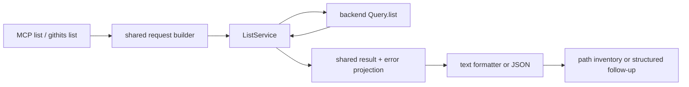

# Unified list client adoption

## Status and expected outcome

**Status: IN PROGRESS.** Phases 1-2 are complete. PR #421 merged to `main` as
`5e541604935f1d7bb030742e2602356b9ef1e88c` on 2026-09-28. PR #428 merged as
`2f3d4fdc7c008623e89aa91558a690b23f0eb309` on 2026-09-30. Phase 3 remains;
its adoption steps are detailed below and require a published artifact containing
Phase 2 before implementation starts.

The merged Phase 1 head passed 5,044 tests, typecheck, formatting, build,
149-step live CLI smoke, 65-step live MCP smoke, 36-step built CLI smoke, and
9-step built MCP registration smoke against production. Authenticated
package, repository, and site list/read follow-ups passed. Backend
PR #2817 merged as `518e45d301d0ba3f451ff56034551addc2bfc7fe`; backend
PR #2857 subsequently corrected site actions to target-relative paths and is
deployed to production.
Live CLI replay passes for the Express site root, a normal page with and
without its trailing slash, and the same page through a nested site scope. The
client work is on `main`. Both `githits@0.23.0` and `@githits/mcp@0.23.0`
are published from `1739290b03ebcb8dee920f536c30f9ac1e0145e8`, verified via
npm metadata and both release tags on 2026-09-30. That release includes Phase 1
CLI listing and shared site-page reads, but predates Phase 2 MCP consolidation
and the text continuation footer. Publication of those later changes and
hosted adoption remain unverified.

Replace the callable MCP `code_files` and `docs_list` tools with one `list`
tool, and add the matching top-level `githits list` command. The `list`
description leads with listing intent and retains both retired tool names in a
later compatibility sentence during the client-skill grace period, allowing
full-description tool search from stale guidance to discover the replacement.
The new surface browses exactly one package source tree, repository snapshot,
or hosted documentation site, follows familiar path/glob semantics, and
paginates with an opaque cursor. Compact text is a path inventory; lossless
JSON retains backend-authored actions that feed directly into `read` or another
`list` call.

Package and repository inventories contain source files and documentation
files together. Hosted pages remain a separate inventory selected by an
explicit `site:` target. Content search remains the job of `search`; `list`
enumerates known inventory.

## Verified current state

### Backend contract

The target backend schema is PR #2817 commit
`d7837a6c2506395ce7a17ea0b9467b831e0bb0b0`, with full schema hash
`sha256:cbddb30fa7d08ac5af41799828767c607a704dc88880c33ae201e14c5d2cc672`.
Its `priv/graphql/CHANGELOG.md` entry records the matching
`sha256:cbddb30fa7d0` prefix. The already-deployed base contract adds:

```graphql
list(
  target: String!
  paths: [String!]
  recursive: Boolean
  fileTypes: [String!]
  languages: [String!]
  intents: [FileIntent!]
  limit: Int
  after: String
  waitTimeoutMs: Int
): ListResult!
```

`ListResult` identifies a `SOURCE` or `SITE` inventory, returns bounded
`FILE`, `PAGE`, and `DIRECTORY` entries, exposes source or site lifecycle
metadata, and supplies `hasMore` plus `nextCursor` without claiming a total.
Each entry contains exact nullable `read` and `browse` actions. The action
target/path/paths are authoritative; `ListEntry.path` is display identity and
must not be reconstructed into a locator.

The permanent backend documentation establishes these semantics:

- A package target covers the manifest-owned source tree at the served commit,
  excluding sibling and independently owned nested packages. It does not claim
  exact registry-artifact contents. A repository target covers the whole served
  snapshot. A site target covers one registered, authorized site owner and never
  discovers or creates a site.
- Omitted paths browse immediate roots. Literal paths and globs form a union.
  `*`, `?`, character classes, backslash escaping, and whole-component `**` are
  supported. Dot-prefixed paths are ordinary inventory entries.
- Source paths are package- or repository-relative. Site paths are relative to
  the supplied `site:` target. Emitted browse paths are authoritative and must
  be replayed unchanged with their supplied target.
- Glob depth is independent of recursion. With recursion off, selected
  directories expose immediate children. With recursion on, selected
  directories expand to descendant leaves and no directory rows are emitted.
- Source-only `fileTypes`, `languages`, and `intents` filters run before
  hierarchy and pagination. Nonempty source filters are invalid for sites.
- The default page size is 100 and the maximum is 500. At most 1,000 nonempty
  path operands of at most 2,048 UTF-8 bytes each are accepted. Wait is
  0-300000 milliseconds and defaults to zero.
- Continuation requires the same target, paths, recursion, and source filters.
  Limit and wait may change. A changed selection, source snapshot, site
  membership, or emitted site metadata returns `VALIDATION_ERROR`; callers
  restart from page one.
- Source file reads are pinned to a repository commit and exact
  repository-relative path. Package directory browsing stays package-scoped
  and version-pinned; it is unavailable when the backend cannot form a
  versioned package target. Hosted PAGE actions use the requested `site:`
  target plus a target-relative path when that pair resolves the stored URL.
  `/` addresses the root. A single non-root trailing slash is omitted when no
  active slashless counterpart exists; distinct slash variants remain exact.
  Exceptional origins retain exact-URL actions.
- An unprepared source at zero wait returns its typed indexing error. Positive
  wait can return an `INDEXING` result with empty entries. Sites return active
  pages during refresh and report inventory, crawl, coverage, and preparation
  states separately.
- `SOURCE_INVENTORY_SCOPE_UNAVAILABLE` fails package scope closed and includes
  an explicit repository/commit alternative. `LIST_UNSUPPORTED_API` and
  `LIST_PAGE_TOO_LARGE` must not fall back to `listRepoFiles`.

Evidence:

- `~/proj/githits/pkgseer-backend/priv/graphql/schema.graphql`
- `~/proj/githits/pkgseer-backend/priv/graphql/CHANGELOG.md`
- `~/proj/githits/pkgseer-backend/graphql-docs/docs/list.md`
- `~/proj/githits/pkgseer-backend/docs/implementation/UNIFIED_LIST.md`

The site-read changelog section merged in backend PR #2817 and is the client
implementation contract. Authenticated live CLI conformance on
2026-09-26 verified that the hosted endpoint exposes the base `Query.list` for
package, repository, and site targets; the covered semantics and remaining
Phase 2 cases are recorded in `docs/implementation/unified-list.md`. On
2026-09-28, the production endpoint emitted the new logical PAGE actions and
accepted their `site:` target plus host-relative path for root, normal,
trailing-slash, and nested-scope reads.

### Original GitHits client surface (before Phases 1-2)

`code_files` calls `CodeNavigationService.listFiles` / `Query.listRepoFiles`.
It has sixteen MCP arguments, offset-like bounded results without a continuation
cursor, source-only output, and older path-prefix/selector/hidden semantics.
`docs_list` calls `PackageIntelligenceService.listPackageDocs`; it addresses a
package rather than an exact site and mixes hosted and repository-backed pages.
Its output does have cursor pagination.

The stable MCP catalog registers both tools in
`packages/mcp/src/mcp/server.ts`. `McpToolServices` currently injects
`CodeNavigationService`, `PackageIntelligenceService`, and the already unified
`ReadService`. CLI equivalents live at `githits code files` and
`githits docs list`; `githits read` demonstrates the intended migration pattern:
the compact top-level command uses a dedicated transport-neutral service while
legacy grouped commands remain on their legacy roots.

The current implementation and active documentation contain recovery hints,
quick-start routing, smoke assertions, catalog contracts, parity tests, and
agent workloads that name `code_files` or `docs_list`. Historical eval reports
remain historical evidence and are not rewritten.

The pre-change descriptor measurement at `175c15c` is 3,659 UTF-8 bytes for
`code_files`, 1,526 for `docs_list`, and 5,188 for their serialized pair
(`name`, description, input schema). This is a payload baseline, not a runtime
or token-latency claim.

### Merged state verified on 2026-09-30

Fresh `origin/main` is `2f3d4fdc7c008623e89aa91558a690b23f0eb309`.
The stable catalog now registers `list`, not `code_files` or `docs_list`;
the public client exports `ListService` and `ListServiceImpl`, and hosts must
provide `McpToolServices.listService`. Main retains unified grep, target-relative
site paths, and the new search page-locator behavior.

PR #428's final checks passed for build, public MCP package validation,
Ubuntu/Windows tests, and Bun/Node 20/22/24/26 compatibility. Its pre-rebase
live CLI/MCP smoke and Codex workload evidence is recorded below. The final
rebase preserved main's search-locator wording; two instruction assertions
were updated and their 13-test suite passed. Claude eval remained unavailable
because the local CLI was logged out.

The canonical CLI skill already prefers top-level `githits list`, including
the released 0.23.0 copy. Its pagination advice still obtains the cursor through
JSON, and its reference still says MCP has no unified list counterpart. These
are the remaining release-dependent guidance updates for Phase 3.

Both package manifests and npm latest remain 0.23.0. The unified MCP change
fragment is still pending. Release PR #436 is open in another lane; this check
does not adopt its work. The earlier remote lookup used the wrong repository
name. The verified repository is `githits-com/githits-remote-mcp`; its current
main and adoption contract are recorded in Phase 3 below.

## Scope and non-goals

Phases 1-2 include the transport service, shared
request/result/error/formatter layers, MCP tool, top-level CLI command, service
composition, migration of active guidance and recovery actions, tests, public
documentation, eval workloads, and release fragments.

It does not change backend inventory behavior, merge source and site storage,
discover documentation sites, add content search, redesign `code_grep`, remove
legacy CLI commands, deploy `pkgseer-backend` or `remote-mcp`, or publish a
release. It does not add a hidden-entry flag, prefix mode, client-side full
inventory scan, fallback to legacy GraphQL roots, fabricated total, or client
snapshot/cache infrastructure. It does not keep callable MCP aliases for
`code_files` or `docs_list`; compatibility is discovery wording on `list`.

## Target contract

### Canonical surfaces

The MCP tool is named `list`. Its first description sentence is:

> List files and documentation paths in a known package, repository, or site.

This intent-focused sentence is under 80 characters and distinguishes
enumeration from content search on the standalone deferred-tool selection
surface. A later sentence states exactly:

> Replaces code_files and docs_list.

That compatibility sentence preserves both legacy identifiers for
full-description tool search from stale installed skills. Other following
sentences explain package, repository, and explicit-site targets plus call
mechanics. Keep the compatibility sentence through Phase 3; removing it
requires a later grace-period decision based on client-skill adoption and is
outside this plan. The MCP arguments map directly to `Query.list`:

| MCP argument | Backend argument | Contract |
| --- | --- | --- |
| `target` | `target` | Required compact package/repository target or explicit `site:` target |
| `paths` | `paths` | Optional literal/glob union; omitted or empty browses roots |
| `recursive` | `recursive` | Optional boolean; preserve explicit `false` |
| `file_types` | `fileTypes` | Optional source-only raw labels |
| `languages` | `languages` | Optional source-only raw labels |
| `intents` | `intents` | Optional source-only `FileIntent` values |
| `limit` | `limit` | Optional integer, 1-500 |
| `after` | `after` | Optional opaque cursor |
| `wait_timeout_ms` | `waitTimeoutMs` | Optional integer, 0-300000 |
| `format` | client-only | `text` by default; `json` for structured consumers |

Validation accepts empty arrays as omitted filters, rejects blank array
members, preserves explicit false values, and treats an empty cursor as
omitted. It enforces documented array/count/integer bounds before transport but
does not parse or rewrite emitted action values. Source filter names and values
remain visible in the schema instead of being encoded into path globs.

The CLI is:

```text
githits list <target> [paths...]
  -R, --recursive
  --file-type <type>   (repeatable)
  --language <name>    (repeatable)
  --intent <intent>    (repeatable)
  --limit <n>
  --after <cursor>
  --wait <ms>
  -s, --silent
  --json
```

Paths are variadic positional operands so calls read like `ls` while retaining
the backend's single `paths` union. Help tells shell users to quote globs.
CLI and MCP text use one compact path-only format. JSON uses the detailed
GraphQL projection and carries complete selected metadata, actions, and paging
state.
`--after` deliberately matches `Query.list` and the existing docs-list cursor
flag; `--wait <ms>` matches `githits read` and code navigation commands. This
command does not adopt the search commands' seconds unit or grep's `--cursor`
spelling.

Examples:

```text
githits list npm:express@5.2.1
githits list npm:express@5.2.1 lib/ -R
githits list github:expressjs/express@v5.2.1 '**/*.md'
githits list site:expressjs.com 'en/5x/api/'
```

### Result and output behavior

One shared projection and formatter serve MCP and CLI. JSON preserves the
selected backend contract in camelCase: inventory identity, requested and
canonical targets, entries and exact actions, continuation, source resolution
and indexing fields, and site inventory/crawl/coverage/preparation fields.
Nullable fields stay nullable where absence is meaningful; no synthetic total
or reconstructed action is added.

Text output starts with `# source <canonical-target>` followed by one unquoted
path per line. When the backend has another page, the header adds
` | more results available`.
If no canonical target is available, the header uses the requested target.
CLI dims the header when color is enabled; MCP uses the same text without ANSI.
CLI `-s, --silent` omits the header and progress display so stdout contains
only path lines for piping; an empty inventory emits no bytes. JSON is
unchanged.
Source inventories add `follow up with "read <canonical-target> $path"` so a
returned file can be read without reconstructing its source identity.
Directory paths end in `/`; source files have no prefix. Paths escape
controls and backslashes so the line-oriented format stays unambiguous; quotes,
spaces, and ordinary Unicode remain literal. The text surface omits titles,
entry kinds, counts, per-entry commands, and lifecycle diagnostics. When a
cursor is available, a footer tells CLI callers to reuse the same list with
`--after` and MCP callers with `after`. For sites, compact projection includes exact `read.target` and
`read.path` values. The header reuses a shared site action target, and PAGE
rows render the corresponding target-relative path; `/` is the root. DIRECTORY
rows remain relative and end in `/`. A meaningful PAGE trailing slash is
preserved when the backend must distinguish coexisting slash variants.
Exceptional URL-only PAGE actions render their exact target. If logical PAGE
actions disagree on the site target, the header omits follow-up guidance.
The formatter never derives an action from a site display path. Default text
contains the cursor and follow-up guidance needed by agents. JSON remains for
programmatic consumers that parse structured actions, lifecycle, or metadata.
This keeps one token-efficient text contract for CLI and MCP.

### Errors and continuation

The client preserves backend error codes, retryability, and safe extension
metadata in the existing mapped-error envelope. List-specific recovery is:

- `SOURCE_INVENTORY_SCOPE_UNAVAILABLE`: show the backend repository/commit
  alternative from typed `extensions.repo_url` and `extensions.commit_sha`,
  while stating that accepting it broadens scope;
- `VALIDATION_ERROR` on a call with `after`: because the backend does not expose
  a cursor-specific reason, advise restarting once without `after` and, if the
  error recurs, correcting the request; without `after`, advise correcting the
  request;
- site `NOT_FOUND`: resolve/register an explicit site target;
- indexing: retry the same call with bounded wait or inspect the emitted
  progress reference; and
- `LIST_UNSUPPORTED_API` / `LIST_PAGE_TOO_LARGE`: report the producer
  incompatibility without legacy fallback.

Transport, HTTP, authentication, terms, client-update, and malformed-response
behavior follows existing core service conventions. Unknown codes remain
visible rather than being misclassified from message text.

The scope-unavailable alternative is the one sanctioned client-composed
locator: only when both extension values are nonempty strings, form
`<repo_url>@<commit_sha>`, which `Query.list` and `read` accept as a pinned
repository target. If either field is absent, preserve the backend error without
inventing an action. This does not generalize into reconstructing entry actions.

## Target architecture and ownership

`packages/core-internal` naturally owns a new `ListService` because `Query.list`
is transport-neutral and crosses source/site domains. It owns request/result
types, minimal GraphQL selection, runtime validation, transport, token refresh,
and a dedicated list error family. That family reuses shared auth, terms,
client-update, HTTP, and transport primitives while owning list-specific
GraphQL codes and extension fields; it does not classify the target into the
older code-navigation/package-intelligence error families. Putting it into
`CodeNavigationService` would be a
smaller edit but would make hosted-site inventory depend on a source-only
abstraction; that ownership is wrong.

`packages/mcp/src/shared` owns caller normalization, JSON projection, error
mapping, and the shared text formatter. `packages/mcp/src/tools/list.ts` owns
the MCP descriptor and handler. `src/commands/list.ts` owns Commander syntax
and terminal invocation. `src/container.ts` and `McpToolServices` inject the
service; hosts continue to own endpoint, token/header/fetch, diagnostics, and
request scope.


```mermaid
flowchart LR
  A[MCP list / githits list] --> B[shared request builder]
  B --> C[ListService]
  C --> D[backend Query.list]
  D --> C
  C --> E[shared result + error projection]
  E --> F[text formatter or JSON]
  F --> G[path inventory or structured follow-up]
```

`ListService` is exported by `packages/core-internal/src/index.ts`. Phase 2
exports it through the public `@githits/mcp/client` entrypoint and makes
`McpToolServices.listService` a required host integration field, following
`readService`. Its request has an internal compact/detailed projection choice.
The compact query fetches the base shared result: identity, entry kinds and
paths, cursor, and bounded lifecycle fields, including coverage reason and site
preparation. Site text also fetches exact read actions; source text does not.
The text formatter emits only the header and paths. JSON additionally selects
entry titles/browse actions, file metadata, full resolution, availability, and
indexing estimates through GraphQL `@include` variables. Response schemas
accept omitted detail fields.
Wire tests assert variables and selections for both projections, including that
neither fetches bodies, snippets, or section trees.

## Cross-cutting constraints

- **Compatibility:** remove `code_files` and `docs_list` from the callable MCP
  catalog when `list` lands, without registering aliases. Keep their exact
  names in a later `list` description sentence so full-description tool search
  from stale client skills can discover the replacement, strengthening the
  existing `read` migration pattern. The first sentence and first 80 raw
  characters remain focused on natural listing intent. Keep
  `githits code files` and `githits docs list` on their unchanged legacy
  services as CLI compatibility cohorts, with their existing deprecation
  pointers to `githits list`. Their execution behavior, scope, and pagination
  remain unchanged; they are not aliases for `githits list`.
- **Custom endpoints:** compact `list` requires `Query.list`. Do not silently
  call deprecated roots when the endpoint lacks it.
- **Migration/rollback:** the client package can be rolled back to restore the
  old advertised MCP catalog. Backend legacy roots remain intact. No data
  migration or feature flag is needed.
- **Security:** all surfaces remain read-only information tools. Treat external
  titles and paths as data, never commands. Preserve action strings exactly in
  structured output and quote them safely in terminal follow-ups. Never log
  cursors or user tokens through diagnostics beyond existing request metadata
  policy.
- **Performance:** the service requests only bounded metadata. Paging and
  filtering remain backend-owned; no client-side materialization is allowed.
  Descriptor bytes are measured before/after with the same serializer. Runtime
  optimization requires a demonstrated client regression; backend query
  performance is outside this repository.
- **Documentation:** create `docs/implementation/unified-list.md`; update active
  tool, CLI, parity, config, and annotation documentation. Update canonical
  skills/instructions through the plugin-maintenance workflow and regenerate
  generated assets. Historical observations stay unchanged.
- **Release impact:** each increment adds its own fragment. The CLI increment
  marks `githits: minor`, `@githits/mcp: none`; the MCP consolidation marks both
  artifacts `minor`, matching the unified-read precedent and the public surface
  changes. Release preparation can reassess only if the repository's 0.x policy
  changes before merge.

## Assumptions and unknowns

Overall assumptions:

- Backend PR #2817 plus the target-relative correction in #2857 and permanent
  list/read documentation define the site-action contract.
- `Query.read` continues to accept the exact list actions preserved in JSON.
- Hosted MCP continues to consume the published `@githits/mcp` package and
  compose services per request.

Overall unknowns:

- Final released package versions and remote deployment timing are unknown and
  are chosen during authorized release/adoption work.
- The evidence threshold and date for removing `code_files` / `docs_list` from
  the `list` description are a later product decision after client-skill
  adoption. This plan keeps the compatibility wording through release and
  hosted adoption.

Open product decisions for Phases 1-3: **none**. The user chose one paths/glob
input, separate target inventories, combined files/docs within source targets,
and `ls`-like query ergonomics. The backend contract resolves glob,
hidden-path, recursion, filter, paging, action, and lifecycle details. Backend
PR #2817 resolves site addressing, including `/` for the root.

## Phase map

| Phase | Status | Outcome |
| --- | --- | --- |
| 1. Add the shared contract and CLI | **COMPLETE; merged as `5e54160`** | `githits list` browses the backend contract through a tested transport-neutral service and shared formatter. Backend #2817 production conformance and live site action replay pass. |
| 2. Consolidate the MCP surface | **COMPLETE; merged as `2f3d4fd`** | The callable catalog contains `list` instead of `code_files` and `docs_list`; the replacement description retains both legacy names, and current guidance routes package/repository/site browsing and follow-up actions correctly. Deterministic, live, and Codex agent verification pass. |
| 3. Release and hosted adoption | **DETAILED; publication prerequisite pending** | Published CLI and hosted MCP expose the same unified list contract, and live list-to-read/list-to-list paths pass against the deployed backend. |

## Phase 1 completion record — shared contract and CLI

**Status:** COMPLETE. PR #421 merged to `main` as
`5e541604935f1d7bb030742e2602356b9ef1e88c` on 2026-09-28.

The merged increment added the transport-neutral list service and shared
request, projection, error, and path-only text contract; registered the
`githits list` CLI; retained legacy grouped CLI execution; and admitted
backend-authored `site:` target plus page-path actions through unified `read`.
The final text contract includes direct read guidance, the explicit
`more results available` pagination cue, and `-s, --silent` paths-only output.

The reviewed head passed 5,044 tests, typecheck, formatting, build, the
100-entry list-text size fixture, 149-step production CLI smoke, 65-step
production MCP smoke, 36-step built CLI smoke, and 9-step built MCP
registration smoke. Production checks covered package, repository, and site
list/read follow-ups, package continuation, paths-only output, root and normal
site pages, trailing-slash handling, and nested site scope. PR checks passed on
Ubuntu, Windows, Bun, Node 20, 22, 24, and 26, including public MCP package
validation. Backend PR #2817 is deployed to production; the CLI and MCP package
versions were published at 0.23.0 from `1739290`.

## Phase 2 detailed plan — consolidate the MCP surface

**Status:** COMPLETE. PR #428 merged to `main` as
`2f3d4fdc7c008623e89aa91558a690b23f0eb309` on 2026-09-30. Implementation,
verification, and review are complete; all final PR checks passed.

The 2026-09-28 readiness check confirmed that `origin/main` still registers
`code_files` and `docs_list`, while the public MCP client does not export
`ListService` and `McpToolServices` does not require it. The merged shared list
request, projection, error, and formatter helpers remain available for the new
tool. The plugin-maintenance workflow and all named validation commands exist.
A production package documentation search emitted `site:expressjs.com` in its
default text source summary, validating the planned package-search-to-site-list
route.

**Expected outcome:** stdio MCP and the public MCP package advertise one
callable `list` tool in place of `code_files` and `docs_list`. Its first
description sentence remains focused on listing intent, while a later sentence
names both retired tools so full-description tool search from stale client
skills can discover the replacement.
Its request, output, errors, and path-only text remain identical to the Phase 1
shared contract. The stable MCP quick-start skill teaches package/repository
browsing, explicit site browsing, and package-to-site discovery. The public
CLI `githits-code` skill remains on released behavior until Phase 3 adoption.

**Assumptions:** Phase 1's service/formatter API remains adequate; default text
is the agent follow-up surface for read actions and opaque cursors; the hosted
endpoint continues to implement the verified SDL; docs search can expose
related explicit `site:` targets, while locally enabled `resolve_target`
remains an additional route for fuzzy or natural names. Installed client
skills may continue naming `code_files` or `docs_list` after release. The
verified first-sentence selection boundary remains focused on listing intent;
full-description tool search receives the exact legacy names.

**Unknowns or product decisions:** none. Base endpoint availability was verified
on 2026-09-26; the deployed #2817 site-read shape passed Phase 1 live replay on
2026-09-28. No product decision is open.

**Dependencies:** Phase 1 is merged. The repository-internal
plugin-maintenance workflow governs public guidance changes.

### Ordered implementation

1. Export `ListService` types/implementation through `@githits/mcp/client`, add
   required `McpToolServices.listService`, descriptor mocks, request-scoped host
   contract coverage, and outside-root public-package validation.
2. Add `packages/mcp/src/tools/list.ts` with the reviewed ten-argument schema
   and read-only annotations. Replace `code_files`/`docs_list` factories in the
   stable catalog without registering callable aliases. Lock the exact
   intent-focused first sentence
   `List files and documentation paths in a known package, repository, or site.` and
   its first 80 raw characters. Add the later exact compatibility sentence
   `Replaces code_files and docs_list.` and test that the full description
   contains both legacy identifiers.
3. Replace every active MCP reference that sends callers to `code_files` or
   `docs_list`: tool descriptions, argument descriptions, validation messages,
   structured error/recovery actions, quick-start instructions, local
   experimental guidance, and tests. At the `githits code read` and
   `githits code grep` boundaries, translate shared `list` recovery wording and
   path operands into `githits list <target> [paths...]` rather than leaking MCP
   syntax; add one focused recovery test for each command. Replace the two
   quick-start rows with one list row. State that a package/repository lists its
   own source tree, while hosted docs require an explicit `site:`. Teach callers
   to search a package's docs and reuse an emitted site target before browsing;
   send selected `resolve_target` sites to `list` as well as `search`. Add a
   catalog contract proving no descriptor except `list`'s compatibility
   sentence names either retired tool.
4. Update `packages/mcp/src/mcp/instructions.ts` and
   `skills/githits-mcp/SKILL.md` together, then update implementation docs. Run
   the plugin generator/checker. The public `githits-code` skill advertises
   released CLI behavior and therefore moves to Phase 3 after the matching
   artifacts publish; updating it before release would violate the Agent Skill
   lifecycle. Treat MCP guide changes as current guidance for new or refreshed
   clients; do not assume already-installed skills update with the release.
   Reconcile Phase 4 of
   `docs/plans/mcp-tool-surface-simplification.md` so it does not independently
   expand `code_files`.
5. Update catalog, local server, public surface, parity, smoke, and package
   tests. Add agent workloads for package/repository enumeration, recursion
   versus `**`, exact-site browse/read, continuation, and package docs search ->
   emitted explicit site -> site listing. Cover the enabled `resolve_target` ->
   site-list route in its focused guidance tests. Add a separate `minor`
   fragment for both public artifacts.

Implementation landed as focused service, catalog, migration, smoke, eval,
documentation, and review-fix commits. The stable catalog has 12 tools. The
serialized replacement descriptor (`name`, description, input schema) is 2,892
UTF-8 bytes, 2,296 bytes (44.3%) below the 5,188-byte retired pair baseline.
The serialized stable catalog is 32,282 UTF-8 bytes. These are payload
measurements, not model-token or latency claims.

Final rebased verification on 2026-09-29 passed 5,168 tests with zero failures,
typecheck, formatting, lint with only the repository's pre-existing warnings,
root and MCP builds, plugin generation/checks, public-package validation,
157-step production CLI smoke, 65-step production MCP smoke, 38-step built CLI
smoke, and 9-step built MCP registration smoke. The MCP continuation smoke
requires a real cursor and a distinct second entry.

Five targeted Codex descriptor workloads passed with high confidence and used
default text throughout: continuation, site list-to-read, package/repository
boundaries, recursion versus glob depth, and package-docs discovery followed by
site list/read. Continuation replayed the opaque `after` value; the site case
replayed target-relative `target` and `path`. A matching Claude run could not
start because the local Claude CLI was logged out, so it produced no product
evidence. Codex plus deterministic and live coverage satisfy the practical
"where practical" cross-model requirement without treating that auth failure
as a product result.

### Verification and acceptance

Run the full deterministic suite:

```text
bun test
bun run typecheck
bun run format:check
bun run lint
bun run build
bun run plugins:generate
bun run plugins:check
bun run validate:packages
bun run smoke:cli
bun run smoke:mcp
bun run smoke:cli:built
bun run smoke:mcp:built
```

Measure the replacement descriptor and stable catalog with the same serializer
as the 5,188-byte baseline; report bytes without claiming model-token or latency
improvement. Run targeted descriptor-only `bun run agent:e2e` workloads named
above with neutral prompts through Claude and Codex where practical; do not add
legacy tool names to workload prompts. Inspect `tool-calls.json`,
`final.json`, `metrics.json`, and `isolation-violations.json`; harness completion
alone is not quality evidence.

Backend semantic conformance was established with authenticated CLI calls on
2026-09-26: literals, all supported glob forms, union/deduplication, recursion
on selected directories, source filters before hierarchy, package boundary
isolation, dot-prefixed source paths, host-qualified site inventory paths,
continuation, and the earlier URL-based list-to-read actions all passed. Client
unit tests assert only wire replay and projection. Phase 1 repeated site action
replay after #2817 deployed because that schema behavior changed. Phase 2 uses
the same endpoint to verify the MCP projection and agent routing, and repeats
other backend cases only if the schema or endpoint changes.

Phase 2 is accepted when deterministic and targeted live/eval checks pass; the
catalog advertises `list` and no longer advertises `code_files`/`docs_list`;
the `list` first sentence and first 80 raw characters remain focused on listing
intent, while its full description contains both exact legacy names; no other
catalog descriptor names them and no callable aliases exist; active
recovery/guidance names the canonical tool and package-to-site route;
public exports and request-scoped host construction validate outside root
aliases; and docs, skills, generated assets, and release fragment match the
final surface. If the increment approaches the implementation-size threshold,
split public service/provider wiring from catalog/guidance adoption.

## Phase 3 — release and hosted adoption

**Status:** DETAILED; implementation waits for a published artifact containing
Phase 2. This lane owns the adoption outcome, not the already-open release
PR #436. No production changes or cross-lane messages are authorized by this
planning task.

**Expected outcome:** installed CLI and hosted MCP callers browse the same
package, repository, and site inventories and continue from default text.
Hosted callers discover `list` from stale tool names, then read emitted paths
without reconstructing URLs or repeating the site's scope.

**Ownership:** `@githits/mcp` owns descriptors, tool semantics, shared output,
and backend queries. `githits-remote-mcp` owns its published dependency,
request-scoped service construction, auth/session attribution, transport tests,
and deployment. Canonical CLI skills belong here under `skills/`. Reimplementing
list in the host or using private/workspace imports would duplicate ownership;
the existing published client constructor is sufficient.

### Evidence and prerequisites

Verified on 2026-09-30:

- CLI main is `2f3d4fd`; both npm latest artifacts are still 0.23.0 from
  `1739290`, before MCP consolidation and default-text continuation.
- Release PR #436 proposes 0.24.0 at `d1147b6`, but that head diverges from main
  at `4a0eb1d`. Its `packages/mcp/src/mcp/server.ts` still registers the legacy
  factories, and its list formatter lacks the continuation footer. The proposed
  version alone is therefore insufficient evidence of delivery. This is an
  observation for the release owner; do not alter that lane here.
- Remote main is `1b8437624da56401518b2c29500d50a51fe09e1f`, independently
  verified through GitHub and the cached `origin/main` snapshot. Its manifest
  consumes `@githits/mcp:^0.23.0`. The local checkout is older and has an
  unrelated untracked configuration file; it is evidence only and must not be
  edited or cleaned by this lane.
- `src/services/request-services.ts` constructs the published code-navigation,
  read, package-intelligence, and example clients per request, sharing a static
  inbound token provider, injected fetch, and session/client headers. It has
  no `listService`. `ListServiceImpl` has the same constructor shape as the read
  service: endpoint, token provider, injected fetch, and service runtime.
- Remote transport tests and `scripts/mcp-agent-session.ts` still assert 13
  tools, including both old lists; the smoke prompt calls `code_files`.
  The new package catalog has 12 tools including `quick_start`, eleven with
  output formats. `quick_start` remains closed-world; the eleven evidence
  tools remain open-world and every tool remains read-only/non-destructive.
- Remote `Main CI` at `1b84376` succeeded. Its workflow builds one image,
  deploys dev, then production. Both `/health` endpoints return status `ok`;
  these responses contain no version and prove neither deployed package
  identity nor the current authenticated catalog.
- The canonical CLI skill already teaches top-level list. Its cursor guidance
  still requires JSON, and its reference maps grouped commands to retired MCP
  tools and says unified list has no MCP counterpart. The release branch still
  contains that guidance; this lane's release-gated parity work remains.
- External plan review live checks confirmed root/normal and scoped Express
  site paths against production. Express `lib/` returned six files and no
  subdirectories; `examples/` returned directory rows and recursive leaves.
  The directory probe below therefore uses `examples/` to exercise both cases.

**Dependencies:** Phases 1-2 merged; deployed backend list/read contract;
published CLI and MCP artifacts that demonstrably contain #428's behavior;
execution assigned to a fresh owned remote worktree before making host changes.
No other lane's existing worktree is an implementation target.

**Assumptions:** package exports and service constructor remain compatible with
the merged source. Confirm this from the exact published tarball before editing
the host. The existing remote auth/session transport remains adequate; no new
flag, transport, cache, queue, or fallback is needed. Keep both retired names in
list's compatibility sentence throughout adoption.

**Unknowns or product decisions:** product decisions **none**. Final package
version, publication time, remote merge/deploy SHA, and authenticated endpoint
results do not yet exist for this change. The release owner supplies publication
provenance; resolve package identity before starting the adoption patch and
resolve deployment provenance before endpoint acceptance. 0.24.0 is a candidate,
not an instruction to release or a guarantee that its contents include #428.
Authentication availability is checked using the existing isolated smoke
launcher; inability to authenticate remains unverified evidence, never success.

### Ordered implementation after publication

1. Verify exact npm versions and provenance against the merged implementation.
   Inspect the packed public client for `ListService`/`ListServiceImpl`, required
   host `listService`, the twelve-tool catalog, the compatibility sentence, and
   default-text cursor guidance. Exercise the published CLI outside workspace
   aliases: package root with limit 1, one continuation, and the site read case
   below. Do not proceed with a same-number artifact missing any of these facts.
   Package release preparation itself stays with PR #436's owner.
2. In this repository, update only `skills/githits-code/SKILL.md` and
   `skills/githits-code/references/code-and-docs.md` for the released behavior:
   replay `--after` from text using the same selection; reserve list JSON for
   programmatic consumers; map top-level list to MCP `list`; describe grouped
   lists as CLI compatibility commands without callable MCP aliases. Preserve
   target-relative sites, `/` root, directory slashes, backend-authored exceptional
   read actions, and the distinction between inventory browsing and topic search.
   Update `src/skills-packaging.test.ts` contracts and a pending root-package
   fragment for the packaged skill change; MCP impact is `none` for this
   CLI-skill-only delta. Do not change search or diff JSON exceptions.
3. In a newly assigned remote worktree, follow that repository's
   `.agents/skills/bump-githits-mcp/SKILL.md`. Update the manifest and Bun lockfile
   to the exact released dependency. Add `ListServiceImpl` to constructor
   injection/defaults and return `listService` from `buildRequestServices`, using
   `config.codeNavigationUrl` and the same token provider/fetch/runtime as read.
   No package-owned query or formatter code is copied into the host.
4. Extend request-service tests with a fake list constructor and assert endpoint,
   shared token provider, fetch, session/client headers, and per-request identity.
   In `src/mcp/transport.test.ts`, replace retired inventory/schema assertions
   with the twelve-tool contract and canonical list calls. Adapt only directly
   affected auth/session tests; preserve their original attribution invariant.
   Use the existing injected fetch seam to show list reaches `Query.list` and
   never the deprecated roots. Reconcile other verified changes in the exact
   published package range under the existing bump skill, rather than freezing
   outdated grep/search expectations.
5. Update the remote smoke prompt/tests: 12 total tools, eleven evidence tools,
   no callable old lists, default text, and the bounded list probes below.
   Preserve raw annotation checks and report them unverified if the client
   cannot observe them. Keep existing auth isolation and unrelated smoke coverage.
   Update permanent docs here and remote
   `docs/implementation/remote-mcp-architecture.md` with version, migration, and
   observed evidence. The two repository changes use separate reviewed PRs.
   Prepare the CLI guidance PR after publication, but keep it unmerged until
   hosted production acceptance provides the rollout evidence for
   `docs/implementation/unified-list.md`. The remote PR records implementation
   and pre-deploy evidence; its later deployment results feed the held CLI PR.
6. Stop each PR at its merge gate. Remote main's existing workflow automatically
   deploys dev and production in order, so approval must explicitly cover that
   rollout before triggering the merge; do not imply a dev-only merge. Verify
   workflow/image commit provenance and both environments' results. Do not add
   a deployment gate or alter the pipeline in this increment. Run dev smoke
   once dev is available and production smoke once production is available;
   these are acceptance checks, not a newly promised production gating mechanism.

### Focused acceptance probes and verification

Run the existing deterministic checks appropriate to each patch:

- CLI guidance: `bun test src/skills-packaging.test.ts`, then `bun test`,
  `bun run plugins:generate`, inspect generated diffs, `bun run plugins:check`,
  `bun run format:check`, and `bun run build`. Run the repository-required
  source CLI/MCP smoke for the agent-facing change. Run
  `bun run agent:e2e --agent codex --surface skills --server local --workload
  eval/agentic/workloads/list-continuation.md`; confirm `tool-calls.json` follows
  text without requesting list JSON, inspect `final.json`/`metrics.json`, and
  require no isolation violations. Run Claude as well when its isolated auth
  is available; unavailable auth is reported explicitly. The workload itself
  requests text, so this proves guidance and text continuation agree; it does
  not isolate the skill's effect on spontaneous format choice.
- Remote: `bun test src/services/request-services.test.ts
  src/mcp/transport.test.ts scripts/mcp-agent-session.test.ts`, then `bun test`,
  `bun run typecheck`, `bun run lint`, and `bun run format:check`.
- Deployed remote: `bun run mcp:session:dev -- --smoke` and
  `bun run mcp:session:prod -- --smoke`; add `--login` only if that environment's
  OAuth has not been configured. Never export credentials into prompts, files,
  output, or command arguments. Use an isolated session prompt for list probes
  if the standard smoke cannot express all cases; no new launcher is needed.

The exact live probes, in default text unless code consumes JSON:

1. `list` package `npm:express@5.2.1`, `paths:["package.json"]`: one package-local
   file; read the emitted target/path and require nonempty content.
2. `list` repository `github:expressjs/express`, `limit:3`: take the rendered
   `after`, make exactly one continuation with the same selection, and require
   a distinct next batch. JSON is not needed to retrieve the cursor.
3. `list` repository `github:expressjs/express`, `paths:["examples/"]`: directory
   rows have `/`; `recursive:true` yields descendant leaves. This checks the
   host calls the shared semantics, not a second implementation of glob rules.
4. `list` site `site:expressjs.com`, `paths:["en/resources/"]`: reuse a returned
   page with its supplied target/path. Read must succeed without adding the
   host to the path or constructing an HTTPS URL.
5. `list` scoped site `site:expressjs.com/en/resources`: reuse a returned page
   and read; the path must not repeat `en/resources`. Read `/` for the site's
   landing page when that action is emitted.

**Acceptance criteria:** the exact published package is identified and usable
outside workspace aliases; canonical CLI guidance follows default-text paging
and maps to callable MCP `list`; both deployed catalogs expose the twelve-tool
inventory with correct annotations and the compatibility sentence naming
`code_files` and `docs_list`, while neither legacy list is callable;
package/repository/site probes pass with unchanged
opaque cursors and emitted read/browse action values; host unit evidence shows
request identity isolation and no deprecated-root fallback; release, merge,
image, endpoint, and validation evidence are recorded in permanent docs.
Existing indexing/site lifecycle and error behavior must remain package-owned;
retain the existing package smoke coverage rather than inventing backend states
or claiming observed lifecycle transitions from a successful empty inventory.
An unrelated smoke timeout is recorded by failing tool and does not erase the
focused list evidence, but it cannot be reported as a full-suite pass.

**Rollback:** no data migration. If adoption fails, prepare a remote adoption
revert PR; an explicitly approved merge rebuilds and redeploys dev then prod
through the existing push-to-main workflow. No manual old-image deployment
entrypoint or smoke-based promotion gate is verified. Revert the CLI skill PR
if its guidance needs rollback. Every revert merge and resulting deployment
requires the corresponding authorization; no legacy GraphQL fallback is added.
No performance optimization is proposed, so existing bounded projection and
formatter measurements from Phase 2 suffice; no benchmark sweep is required.

## Phase boundaries and completion

After each increment merges, run `$next-steps` against current `origin/main`,
the backend schema/endpoint, and relevant package/remote host state. Update the
next phase assumptions and detail only then. Do not continue from this plan if
that check reports `REPLAN` or `PRODUCT INPUT NEEDED`.

The effort is complete when Phase 3 acceptance passes and permanent
documentation contains the final contract, architecture, compatibility policy,
and rollout evidence. Keep this plan through the last implementation review;
then transfer any remaining durable facts to `docs/implementation/` and delete
the plan after the final increment merges.

For Phase 3, the held CLI guidance/documentation PR is the final implementation
increment: it includes the remote production evidence before merging. After
that merge, `$next-steps` records completion and deletes this plan in a
documentation-only cleanup commit. There is no extra implementation phase.

## Review history

Internal review found and closed compact/detailed selection over-fetch,
scope-alternative typing, and the missing workspace-internal shared-helper
export. External Claude review ran two rounds. Round 1 raised six accepted
contract/readiness findings: validation-error ambiguity, pinned scope target
construction, client-versus-backend test ownership, list error ownership,
package-to-site discovery, and compatibility/size wording. The plan now uses a
safe two-step cursor recovery, typed optional `repo_url@commit_sha`, separate
client/live evidence, a dedicated error family, explicit discovery guidance,
and two implementation increments. Round 2 was clean after three wording fixes
covering Phase 2 public exports, the legacy docs-list pointer, and this history.
No finding was rejected and no test was run for the plan-only change.

The Phase 2 stale-skill compatibility revision also completed internal and
external plan review. External round 1 found two accepted gaps: the proposed
legacy-name agent prompt violated neutral workload rules, and migration did not
cover every active descriptor/argument/error reference. Its suggestion to put
the retired names in the first sentence was initially accepted, then rejected
after product clarification: repository guidance reserves that sentence and
the first 80 raw characters for natural intent selection, while explicit tool
search uses the full description. The exact names therefore live in a later
compatibility sentence. Round 2 found one accepted CLI-boundary gap after
shared recovery wording changes. Round 3 found only the missing `bun run lint`
verification line. Both were corrected; the final external round counts as
clean under the documentation-only finding rule.

Phase 2 implementation review completed on 2026-09-28. Luna pre-flight found
no code, documentation, or interface mismatch and identified only the unproven
authenticated/eval gates. Internal code review found one accepted smoke gap:
the continuation probe could skip after an exact-file query; `e0889b7` replaced
it with required root pagination and a distinct second entry. External Claude
round 1 found two low-severity maintenance gaps: the release fragment omitted
the required host `listService` migration, and retired unregistered MCP list
factories plus MCP-only renderers remained dead. `e04bfc8` documented the host
contract and removed that dead code while preserving grouped CLI helpers and
their tests. External round 2 re-ran focused tests and typecheck and was clean.

The 2026-09-29 post-rebase review found the list implementation clean and one
minor shared-guidance mismatch: a blanket JSON sentence conflicted with
`code_diff`, whose text intentionally omits most of a full patch. The shared
guide retained its existing required-field exception, while the `list`
descriptor keeps the stricter programmatic-consumer rule. This keeps ownership
with each tool's formatter and resolved the only finding.

Phase 3 planning review on 2026-09-30: internal `code_reviewer` reported no
findings. Claude Opus 5.5 found three small documentation gaps and two wording
issues, all accepted and closed: the directory probe now uses verified
`examples/` instead of directory-free `lib/`; rollback names the existing
revert-and-redeploy workflow; the CLI guidance PR waits for hosted evidence
before its merge and plan cleanup follows that final merge; compatibility
wording names the retired tools explicitly; and the prompted eval is described
as agreement evidence rather than proof of spontaneous format selection.
Closure checked the Phase 3 probes, workflow/rollback language, PR sequence,
completion criteria, and verification claims for sibling contradictions.
The external round counts as clean after these minor documentation corrections;
no product code or infrastructure changed and no second round was required.
